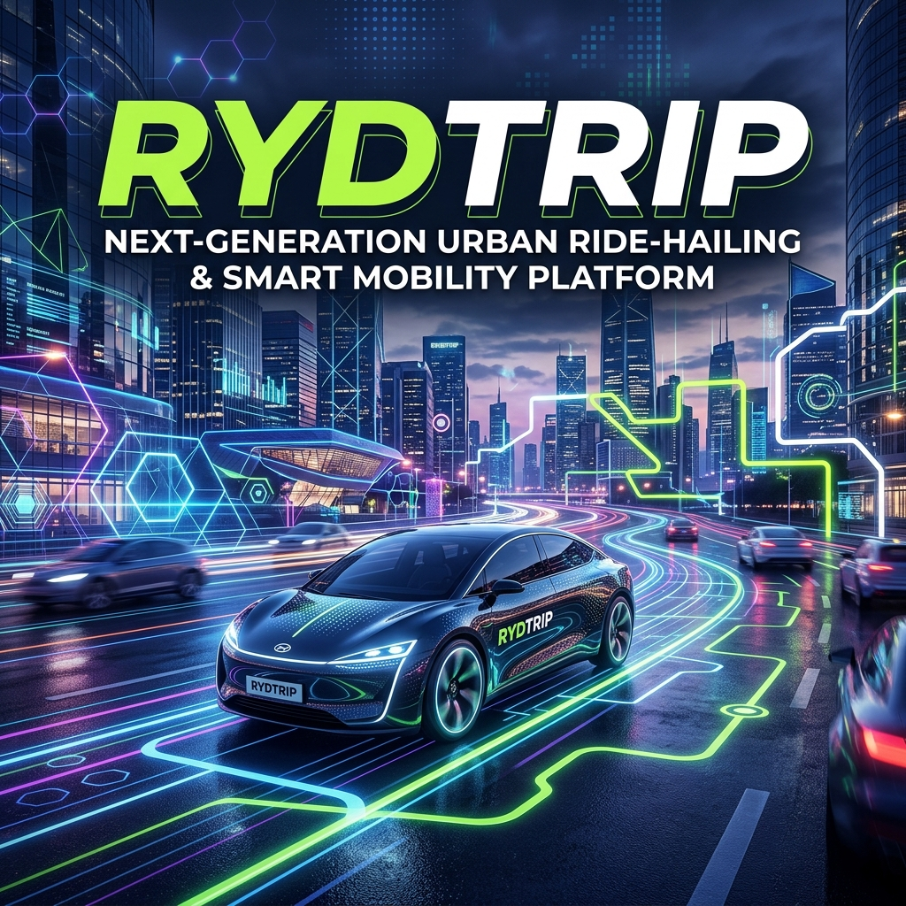

# 🚕 RydTrip



**Production-grade, real-time distributed ride-hailing & dispatch platform** powered by an event-driven microservices architecture, low-latency geospatial matching, atomic driver reservation under high concurrency, and a fintech-grade responsive frontend UI.

---

## 📸 Visual Showcase

### 1. Rider Booking & Search Interface


### 2. Driver Partner Program & Real-Time Earnings


### 3. Distributed Platform Features & Mobile Apps


---

## 🏗️ System Design & Architecture

RydTrip is designed as a distributed, decoupled event-driven system built with Node.js/NestJS microservices communicating over **Apache Kafka**, **Redis GEO**, and **PostgreSQL/PostGIS**.

```mermaid
flowchart TD
    subgraph Frontend["RydTrip Frontend Layer (React 18 + Vite)"]
        RiderUI["Rider Web App\n(Booking, Fare Estimation, Map)"]
        DriverUI["Driver Web App\n(Accept/Decline, Location Telemetry)"]
        DualUI["Dual Dispatch Simulator"]
    end

    subgraph GatewayLayer["API Gateway & Reverse Proxy (Port 3000)"]
        Gateway["NestJS API Gateway\n(JWT Auth, Rate Limiting, Routing)"]
    end

    subgraph Microservices["Backend Microservices Layer"]
        RiderSvc["Rider Service\n(Profile, Rating, History)"]
        DriverSvc["Driver Service\n(Status, Vehicle Info)"]
        TripSvc["Trip Service\n(Booking State Machine, Fares)"]
        LocationSvc["Location Service\n(GPS Telemetry Stream)"]
        DispatchSvc["Dispatch / Matching Engine\n(Geo Radius Search)"]
    end

    subgraph StorageLayer["Data & Event Streaming Layer"]
        Kafka["Apache Kafka Broker\n(Topics: trip.requested, trip.accepted, driver.location)"]
        Redis["Redis + Redis GEO\n(Driver Spatial Index & Cache)"]
        Postgres[("PostgreSQL + PostGIS\n(Persistent Storage & Spatial Queries)")]
    end

    RiderUI -->|REST / WebSocket| Gateway
    DriverUI -->|REST / WebSocket| Gateway
    DualUI -->|REST / WebSocket| Gateway

    Gateway --> RiderSvc
    Gateway --> DriverSvc
    Gateway --> TripSvc
    Gateway --> LocationSvc

    TripSvc -->|Persist Trip| Postgres
    TripSvc -->|Publish trip.requested| Kafka

    LocationSvc -->|Update Driver Location| Redis
    DispatchSvc -->|Consume trip.requested| Kafka
    DispatchSvc -->|Query Nearby Drivers (GEORADIUS)| Redis
    DispatchSvc -->|Atomic Driver Lock| Redis
    DispatchSvc -->|Publish trip.accepted| Kafka

    TripSvc -->|Consume trip.accepted| Kafka
    TripSvc -->|Update State (ACCEPTED)| Postgres
```

### End-to-End Dispatch Flow
1. **Booking Request**: Rider submits pickup and dropoff points via the **HeroRideForm** on the web app.
2. **API Routing**: The **API Gateway** validates JWT tokens and routes request to **Trip Service**.
3. **Event Emission**: **Trip Service** persists the pending trip into **PostgreSQL** and emits a `trip.requested` event to **Kafka**.
4. **Geospatial Matching**: **Dispatch Engine** consumes `trip.requested`, queries **Redis GEO** for active drivers within a 5 km radius, and broadcasts candidate trip requests over WebSockets.
5. **Atomic Reservation**: The first driver to click *Accept* acquires an atomic lock in **Redis** (preventing double-booking). Dispatch emits `trip.accepted`.
6. **Telemetry & Live Tracking**: **Location Service** ingests driver GPS coordinates and streams real-time updates back to the Rider's **Leaflet map**.

---

## 🛠️ Complete Tech Stack

### **Frontend & UI Layer**
- **Framework**: React 18, Vite, TypeScript
- **Design System**: Customized Wise-inspired fintech aesthetic (lime-green `#9fe870` CTA accents, sage `#e8ebe6` canvas, weight 900 display typography, 24px canonical rounded cards)
- **Styling**: Tailwind CSS, CSS Custom Tokens
- **Mapping & Geospatial**: Leaflet, React-Leaflet
- **State Management**: Zustand (with session persistence), TanStack React Query
- **Icons & UI Components**: Lucide-React, clsx, tailwind-merge

### **Backend Microservices**
- **Core Framework**: NestJS, TypeScript, Node.js 22 LTS
- **ORM & Database**: Prisma ORM, PostgreSQL + PostGIS (spatial queries)
- **Event Streaming**: Apache Kafka (KafkaJS) with Dead Letter Topics (DLT) & exponential backoff retries
- **In-Memory Cache & GEO**: Redis (+ Redis GEO indexing for driver locations)
- **Real-Time Communication**: WebSockets (`socket.io` / native WS)

### **DevOps & Infrastructure**
- **Containerization**: Docker, Docker Compose
- **Orchestration**: Kubernetes (`kind` local cluster, EKS for production cloud demos), Helm Charts
- **GitOps & CI/CD**: Argo CD, GitHub Actions
- **Infrastructure as Code (IaC)**: Terraform
- **Observability**: Prometheus, Grafana, OpenTelemetry, Jaeger tracing
- **Testing**: Jest, Supertest, Testcontainers, k6 performance benchmarking

---

## 📁 Repository Layout

```text
RydTrip/
├── apps/
│   ├── web/                 # React 18 + Vite Frontend App (Rider, Driver, Dual Mode)
│   └── driver-web/          # Dedicated Driver Interface App
├── services/
│   ├── api-gateway/         # NestJS Gateway & Reverse Proxy
│   ├── rider-service/       # Rider profile management
│   ├── driver-service/      # Driver onboarding & vehicle details
│   ├── trip-service/        # Booking state machine & fare computation
│   ├── location-service/    # Real-time GPS location ingestion
│   └── dispatch-service/    # Kafka-driven driver matching engine
├── libraries/               # Shared packages (event-schema, security, observability)
├── infrastructure/          # Terraform scripts & Kubernetes Helm/ArgoCD manifests
├── docs/
│   ├── images/              # README Screenshots (hero, driver, features)
│   ├── architecture/        # System design docs & PRD
│   ├── adr/                 # Architecture Decision Records
│   └── roadmap/             # Phase-by-phase implementation plan (PHASES.md)
└── docker-compose.yml       # Complete local microservices stack
```

---

## ⚡ Getting Started

### 1. Prerequisites
- **Node.js**: v22 LTS or later
- **Docker & Docker Compose**: Installed and running

### 2. Start Full Stack (Services + Infrastructure)
Run the entire microservice ecosystem (Postgres, Redis, Kafka + all 6 services) with a single command:

```bash
docker compose up --build -d
```

#### Exposed Service Ports:
- **Web App**: `http://localhost:3000` (or `3008` if 3000 is occupied)
- **API Gateway**: `http://localhost:3000`
- **Rider Microservice**: `http://localhost:3001`
- **Driver Microservice**: `http://localhost:3002`
- **Trip Microservice**: `http://localhost:3003`
- **Location Microservice**: `http://localhost:3004`
- **PostgreSQL**: `localhost:5433` (Database: `rydtrip`)
- **Redis**: `localhost:6380`
- **Apache Kafka**: `localhost:9094`

### 3. Run Frontend Web App Locally
For active frontend UI development:

```bash
npm run dev --workspace=@rydtrip/web
```

---

## 🛡️ Reliability & Resilience

- **Dead Letter Queue (DLQ)**: Every Kafka consumer retries failed events with exponential backoff and jitter. Persistent failures are parked on per-consumer Dead Letter Topics (`<group>.dlt`).
- **Idempotent Consumers**: PostgreSQL `processed_events` tracking prevents duplicate event processing during network re-transmissions.
- **Atomic Driver Lock**: Redis distributed locks guarantee that a ride request can never be accepted by multiple drivers simultaneously.

---

## 📄 License

This project is licensed under the [MIT License](LICENSE).
