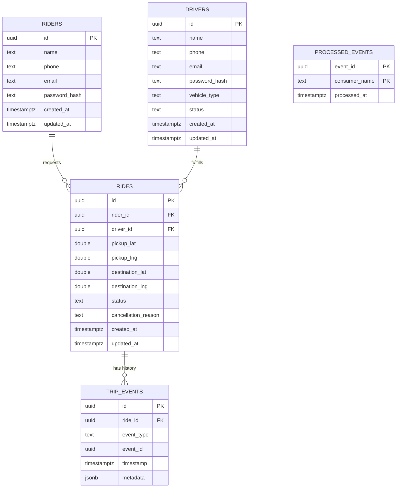

# Data Model

PostgreSQL is the durable source of truth for business data (Phase 3 implements this
via Prisma). Redis (Phase 6) and Kafka (Phase 5) hold no durable business state.

**Physical ownership**: this document describes the logical entities and their
relationships. Physically, each table lives in the database owned by the service that
writes it — there is no single shared database and no cross-service foreign keys. See
[ADR-004](../adr/004-database-per-service.md) for the full rationale and the exact
service → database → table mapping.

## Entity relationship diagram

## Tables

### `riders`

| Column | Type | Constraints |
|---|---|---|
| `id` | uuid | PK, default `gen_random_uuid()` |
| `name` | text | not null |
| `phone` | text | not null, unique |
| `email` | text | not null, unique (ADR-005) |
| `password_hash` | text | not null, bcrypt (ADR-005) — never returned by any endpoint |
| `created_at` | timestamptz | not null, default now() |
| `updated_at` | timestamptz | not null, default now() |

### `drivers`

| Column | Type | Constraints |
|---|---|---|
| `id` | uuid | PK |
| `name` | text | not null |
| `phone` | text | not null, unique |
| `email` | text | not null, unique (ADR-005) |
| `password_hash` | text | not null, bcrypt (ADR-005) — never returned by any endpoint |
| `vehicle_type` | text | not null |
| `status` | text | not null, one of the driver state machine states, default `OFFLINE` |
| `created_at` | timestamptz | not null, default now() |
| `updated_at` | timestamptz | not null, default now() |

Index: `(status)` — Dispatch/operator queries filter by status; primary availability
lookups still go through Redis GEO (Phase 6), not this index. This is a fallback/audit
path, not the hot path.

### `rides`

| Column | Type | Constraints |
|---|---|---|
| `id` | uuid | PK |
| `rider_id` | uuid | FK → `riders.id`, not null |
| `driver_id` | uuid | FK → `drivers.id`, nullable (unset until `MATCHED`) |
| `pickup_lat` / `pickup_lng` | double precision | not null |
| `destination_lat` / `destination_lng` | double precision | not null |
| `status` | text | not null, one of the ride state machine states |
| `cancellation_reason` | text | nullable, set only when `status = CANCELLED` |
| `created_at` | timestamptz | not null, default now() |
| `updated_at` | timestamptz | not null, default now() |

Indexes: `(rider_id, created_at)` for ride history queries; `(driver_id)` for a
driver's active/past rides; `(status)` for operator dashboards.

`rides` holds **current state only**. It is not an event log — that's `trip_events`.

### `trip_events`

Append-only audit trail of every state transition and significant domain event tied to
a ride. Exists separately from `rides` so the current-state row stays cheap to read
while still preserving full history for debugging, replay, and the DLT investigation
workflow (Phase 8).

| Column | Type | Constraints |
|---|---|---|
| `id` | uuid | PK |
| `ride_id` | uuid | FK → `rides.id`, not null |
| `event_type` | text | not null (e.g. `ride.requested`, `driver.accepted`, `trip.completed`) |
| `event_id` | uuid | not null — the Kafka event envelope's `eventId`, for cross-referencing |
| `timestamp` | timestamptz | not null |
| `metadata` | jsonb | event-specific payload (candidate driver list, cancellation reason, etc.) |

Index: `(ride_id, timestamp)` for reconstructing a ride's full history in order.

### `processed_events`

Idempotency ledger, owned by Trip Service (the only consumer here with a Postgres
database of its own — see the Redis key space section below for Dispatch Service's
equivalent). `TripsRepository.runIdempotent()` inserts into this table as the *first*
statement of the same transaction that applies an event's side effects (Phase 8), so
the two commit or roll back together.

| Column | Type | Constraints |
|---|---|---|
| `event_id` | uuid | part of composite PK |
| `consumer_name` | text | part of composite PK — same event may be legitimately processed once per consumer group |
| `processed_at` | timestamptz | not null, default now() |

Composite primary key `(event_id, consumer_name)` is what makes a duplicate delivery a
no-op: a second insert attempt for the same pair fails the uniqueness constraint, the
whole transaction rolls back untouched, and the consumer treats that as "already
handled" rather than reapplying the side effects or erroring.

## Redis key space (Phase 6/7/8 — not durable, holds no business state)

Owned per-service, same rule as Postgres (ADR-004) applied to Redis keys instead of tables.

| Key | Owner | Purpose |
|---|---|---|
| `drivers:geo` | Location Service (writes), Dispatch Service (reads) | GEO sorted set of driver positions |
| `driver:{id}:state` | Location Service | Hash of `lat`/`lng`/`updatedAt`; its `EXPIRE` is the heartbeat — gone means stale |
| `driver:{id}:reservation` | Dispatch Service | `SET ... NX EX` reservation lock; value is the `rideId` that holds it |
| `processed:{consumerName}:{eventId}` | Dispatch Service | Idempotency ledger (Phase 8) — Dispatch has no Postgres of its own, so this plays the role Trip Service's `processed_events` table plays there. A plain `SET ... EX` (no `NX`): checked before, marked after `handleRideRequested()` succeeds — see [libraries/redis-client/src/idempotency-store.ts](../../libraries/redis-client/src/idempotency-store.ts) for why this doesn't need the same-transaction atomicity `processed_events` has. |

## Kafka Dead Letter Topics (Phase 8 — not durable business state, replayable)

Every `EventConsumer` (see [libraries/event-schema/src/kafka/consumer.ts](../../libraries/event-schema/src/kafka/consumer.ts))
auto-creates and owns a `<consumerGroup>.dlt` topic — `trip-service.dlt`,
`dispatch-service.dlt` today. A message lands there after exhausting retries (3 attempts,
exponential backoff + full jitter), or immediately if its JSON can't even be parsed. Each
record carries the original topic/partition/offset/key, the parsed event envelope (when
there is one), the error message, attempt count, and a timestamp — enough to diagnose
without re-reading source code. Replay with `npm run replay-dlq -- --topic <topic>.dlt`
(see [scripts/replay-dlq.ts](../../scripts/replay-dlq.ts)), which republishes each
record's envelope back onto its original topic.

## What's deliberately not modeled yet

Payments, ratings, ride pooling, surge pricing, and multi-region sharding are out of
scope for the MVP (see [prd.md](prd.md)) and have no tables here. Don't add speculative
columns for them.
