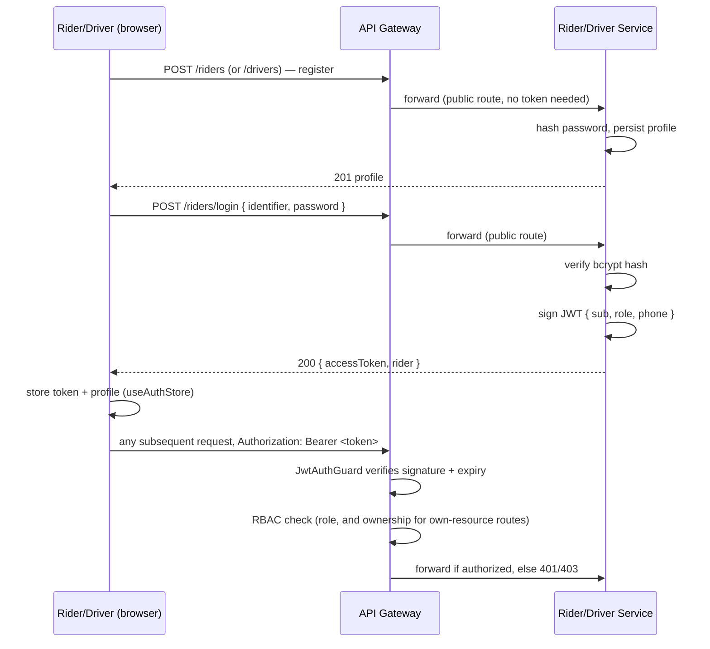

# End-to-End Flow: Login → Booking → Trip Completion

This walks through what actually happens, service by service, from a rider opening the
app to a completed trip — tying together [overview.md](overview.md),
[state-machines.md](state-machines.md), and [sequence-diagrams.md](sequence-diagrams.md)
into one narrative, plus the auth layer those docs only mention in passing. All endpoint
names, DTOs, and behavior below are read directly from the current source, not aspirational.

## 1. Registration

| Role | Endpoint | Service |
|---|---|---|
| Rider | `POST /riders` | Rider Service |
| Driver | `POST /drivers` | Driver Service |

Both are public (no token required — see §2). Passwords are hashed with `bcryptjs`
(10 salt rounds) before storage; there is no separate email/phone verification step in
the MVP. A duplicate phone or email returns `409 Conflict` (Postgres unique constraint,
caught and re-thrown as a clean message). Driver registration additionally carries KYC
fields (license number, vehicle registration, insurance policy, permit number) — see
`create-driver.dto.ts`.

## 2. Login and authentication

| Role | Endpoint | Service |
|---|---|---|
| Rider | `POST /riders/login` | Rider Service |
| Driver | `POST /drivers/login` | Driver Service |

Login takes `{ identifier, password }` (identifier = email or phone), verifies the
password against the stored bcrypt hash, and — **this is the only place a token is ever
minted** — signs a JWT with `{ sub: userId, role: 'rider' | 'driver', phone }`. Rider
Service and Driver Service each sign with the same shared secret (`JWT_SECRET`, falling
back to a fixed local-dev default so the stack runs from a fresh clone with no `.env`).

The API Gateway never issues tokens; it only verifies them, via `JwtAuthGuard`
(`services/api-gateway/src/auth/jwt-auth.guard.ts`) registered as a global `APP_GUARD`.
For every incoming request the guard:

1. Lets `/health` and any path with no configured proxy route through untouched.
2. Lets a short allowlist of **public routes** through with no token: registration,
   login, `GET /drivers/nearby`, and `GET /drivers/:id/vehicle`. The last two exist so a
   **guest can see a real nearby driver and fare estimate before logging in** — they
   return only driver id/coordinates/distance/vehicle type, no PII.
3. Otherwise requires `Authorization: Bearer <token>`, rejecting a missing or
   invalid/expired one with `401`.
4. Runs a small **RBAC table** (`ROLE_POLICIES`) against the verified token: e.g. only
   `rider` may call `POST /rides`, only `driver` may call
   `POST /trips/:id/{driver-arrived,start,complete}`. Several routes also enforce
   **resource ownership** — a driver's token `sub` must match the `:id` in
   `PATCH /drivers/:id/status`, so one driver cannot alter another driver's status or
   location by guessing an id.

This is intentionally a stateless, single-shared-secret scheme pulled forward from a
later phase — see [ADR-005](../adr/005-basic-auth-pulled-forward.md) for what's real
today (login + JWT + RBAC) versus still deferred (OIDC, refresh tokens, an `operator`
role with no registration flow yet — see `Role` in the guard).

On the frontend (`apps/web`), `useAuthStore` (Zustand, persisted to `localStorage` under
key `rydtrip-auth-v3`) calls the matching login/register endpoint, stores
`{ user, accessToken }`, and `apiFetch` attaches the token as a bearer header on every
subsequent call. `RequireAuth` gates any route that needs a logged-in user.

## 3. Browsing and fare estimate (pre-booking)

Before requesting a ride, the rider app calls the public `GET /drivers/nearby` (Location
Service, backed by Redis GEO) to find the single nearest online driver within a 10 km
radius (widened to 50 km once if empty), then `GET /drivers/:id/vehicle` for that
driver's vehicle type. This drives the one real vehicle card shown (real ETA, real
distance) — the base fare table itself is still a client-side constant, since no
pricing service exists yet. This step works for a logged-out guest.

## 4. Requesting a ride

| Step | Call | Effect |
|---|---|---|
| 1 | `POST /rides` (rider-only, via Gateway → Rider Service) | Rider Service validates the rider exists, publishes `ride.requested` to Kafka, returns `202 { rideId, status: "MATCHING" }` **immediately** |

The HTTP call never waits for a match — matching duration is variable (see
[ADR-003](../adr/003-rest-vs-events.md)). From here the ride's authoritative status
lives in Trip Service, advanced entirely by consuming events:

- Trip Service consumes `ride.requested` → ride status `REQUESTED → MATCHING`.
- Dispatch Service separately consumes the same event, queries Redis GEO for ranked
  nearby candidates, and performs an atomic `AVAILABLE → RESERVED` reservation against
  the top one (this atomicity is what prevents two riders being matched to the same
  driver). If the driver rejects or the 15s reservation window times out, Dispatch
  releases the driver and retries the next candidate — the ride itself stays `MATCHING`
  throughout; only a final acceptance is externally visible.
- On acceptance, Dispatch publishes `driver.accepted`; Trip Service moves the ride
  `MATCHING → MATCHED → DRIVER_ARRIVING` (the second hop is automatic, same
  transaction).

Full mechanics (candidate ranking, retry loop, Redis key space) are in
[overview.md](overview.md) and [sequence-diagrams.md](sequence-diagrams.md) — this
document only anchors where auth and the client fit around them.

## 5. Trip lifecycle to completion

Once matched, the rest of the ride is driven by explicit REST calls against **Trip
Service**, guarded by the Gateway's RBAC (driver-only for the first three; either party
for cancel):

| Endpoint | Caller | Transition |
|---|---|---|
| `POST /trips/:id/driver-arrived` | driver | `DRIVER_ARRIVING → DRIVER_ARRIVED` |
| `POST /trips/:id/start` | driver | `DRIVER_ARRIVED → IN_PROGRESS` (rider has boarded) |
| `POST /trips/:id/complete` | driver | `IN_PROGRESS → COMPLETED` |
| `POST /trips/:id/cancel` | rider or driver | → `CANCELLED`, disallowed once `IN_PROGRESS` |
| `GET /trips/:id` | rider, driver, or operator | current trip state |

`POST /rides/:id/cancel` (Rider Service) is the rider-facing cancel-before-match path;
it's fire-and-forget (publishes `ride.cancelled`) since Rider Service doesn't hold ride
state itself — Trip Service's consumer applies the real state-machine guard, rejecting
the cancellation if the ride already progressed somewhere non-cancellable (e.g.
`IN_PROGRESS`). See [state-machines.md](state-machines.md) for the exhaustive transition
table and cancellation reasons, and [sequence-diagrams.md](sequence-diagrams.md) §4 for
the branching logic per current status.

Throughout the trip, the driver's live position streams independently through
`POST /drivers/:id/location` (Location Service → Redis GEO → `driver.location.updated`
on Kafka) — proximity to the pickup point is informational for the client's map, it is
never what advances trip state; only the explicit driver/rider actions above do.

## 6. What's real vs. simulated in the demo UI

`apps/web` (the flagship showcase app, covering both rider and driver views plus a
"Dual View" mode) is real end-to-end for everything above **except** one gap: nothing
today pushes server-side events back to the browser. There is no WebSocket/SSE gateway
on any backend service. So the demo UI runs a small **local, in-browser event-bus
simulation** (`apps/web/src/websocket/client.ts`) purely to visualize the
`REQUESTED → MATCHING → MATCHED → ...` handoff between the rider and driver panels
within one browser tab/session, using the ride's real id, fare, and rider identity.

Concretely: `createRide()` really calls `POST /rides` (real Rider Service, real Kafka
publish, real authenticated identity) and then also emits a local
`ride.status.changed`/`driver.request.received` event so the driver-side UI panel can
react without a backend push channel to listen on. The state values it simulates
through are exactly the same enum the real Trip Service state machine uses — it is a
UI stand-in for "Dispatch found you a driver," not fabricated data layered on top of a
fake backend. `apps/driver-web` and `apps/rider-web` are early standalone scaffolds
(currently just an entry point each) and are not the primary flow described here.

## Related documents

- [overview.md](overview.md) — service responsibilities and component diagram
- [state-machines.md](state-machines.md) — exhaustive ride and driver state machines
- [sequence-diagrams.md](sequence-diagrams.md) — detailed happy-path and retry sequences
- [ADR-005](../adr/005-basic-auth-pulled-forward.md) — auth scope: what's real, what's deferred
- [api-contracts.md](api-contracts.md) — full REST surface per service
