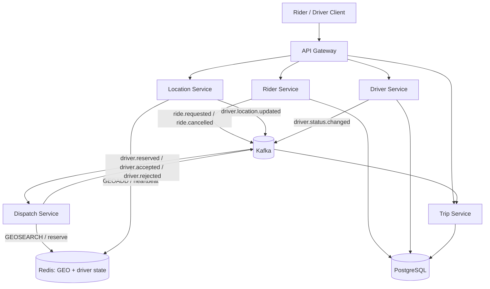

# RydTrip — Architecture Overview

Scope: the services built in Phases 2–7 (Rider, Driver, Trip, API Gateway, Location,
Dispatch). Notification/Analytics services are out of scope until explicitly scheduled.

## Component diagram

## Service responsibilities

**API Gateway** — single entry point for clients. Owns authentication, authorization,
request routing to the correct downstream service, request validation, rate limiting,
and correlation ID injection. Holds no domain state of its own.

**Rider Service** — owns rider profiles and ride creation/cancellation/history. On
`POST /rides` it validates the request, persists a `REQUESTED` ride, and publishes
`ride.requested` — it does not wait for a driver to be found before responding.

**Driver Service** — owns driver profiles and the driver status state machine
(`OFFLINE → AVAILABLE → RESERVED → ON_TRIP → AVAILABLE`, plus `SUSPENDED`). Rejects any
transition that isn't in the allowed set (see [state-machines.md](state-machines.md)).

**Trip Service** — owns the ride/trip lifecycle state machine
(`REQUESTED → MATCHING → MATCHED → DRIVER_ARRIVING → DRIVER_ARRIVED → IN_PROGRESS →
COMPLETED`, with `CANCELLED` reachable from every non-terminal state except
`IN_PROGRESS`). Consumes dispatch and driver-action events to advance ride state; it is
the single writer of a ride's authoritative status.

**Location Service** — the only service that writes to Redis GEO. Accepts
high-frequency driver location pings, upserts the driver's position and a TTL-backed
heartbeat, and publishes `driver.location.updated` for any interested consumer
(analytics, later phases). A driver whose heartbeat TTL expires becomes invisible to
GEO search without any explicit "go offline" call.

**Dispatch Service** — the matching engine. Consumes `ride.requested`, queries Redis GEO
for nearby drivers, filters out unavailable/stale ones, ranks candidates, and performs
an atomic `AVAILABLE → RESERVED` reservation against the top candidate. On reservation
failure or driver rejection it advances to the next candidate. It does not own durable
ride state — it emits events that Trip Service consumes.

## Request flow (narrative)

1. Rider calls `POST /rides` via the Gateway → Rider Service persists `REQUESTED`,
   publishes `ride.requested`, and returns `202` with `{ rideId, status: "MATCHING" }`
   immediately — matching duration is variable and must not hold the HTTP connection.
2. Trip Service consumes `ride.requested` and moves the ride to `MATCHING`.
3. Dispatch Service consumes the same event, queries Redis GEO, and attempts reservation
   against ranked candidates in order.
4. On successful reservation + driver acceptance, Dispatch publishes `driver.accepted`;
   Trip Service moves the ride to `MATCHED` then `DRIVER_ARRIVING`.
5. Driver location updates continue to flow independently through Location Service;
   Trip Service transitions to `DRIVER_ARRIVED`, `IN_PROGRESS`, `COMPLETED` based on
   explicit driver/rider actions, not on location proximity alone (see
   [api-contracts.md](api-contracts.md)).

Full step-by-step sequence diagrams: [sequence-diagrams.md](sequence-diagrams.md).

## Sync vs. async boundaries

Summarized fully in [ADR-003](../adr/003-rest-vs-events.md). Short version: REST is used
wherever a client is waiting for an immediate, specific answer; Kafka is used for
domain facts that one or more other services need to react to, especially anything
whose processing time is variable (matching) or whose delivery must survive a consumer
being temporarily unavailable.

## Consistency model

- **Strong consistency**: driver reservation, ride ownership, ride/driver state
  transitions — see [state-machines.md](state-machines.md) for the exact atomicity
  requirement enforced starting Phase 7.
- **Eventual consistency**: analytics, notifications, dashboards, and driver location
  propagation to anything other than the authoritative Redis GEO index.

## Related documents

- [state-machines.md](state-machines.md) — full ride and driver state machines
- [data-model.md](data-model.md) — PostgreSQL schema
- [api-contracts.md](api-contracts.md) — REST surface sketch per service
- [sequence-diagrams.md](sequence-diagrams.md) — end-to-end flows
- [prd.md](prd.md) — actors, functional and non-functional requirements
- [ADR-003](../adr/003-rest-vs-events.md) — REST vs. events decision rule
