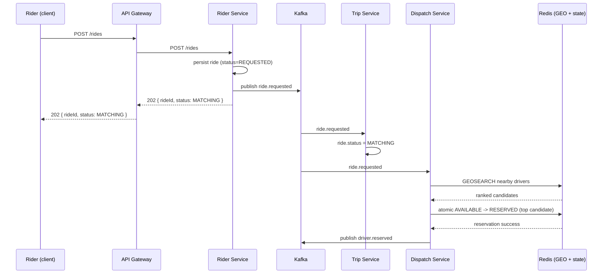
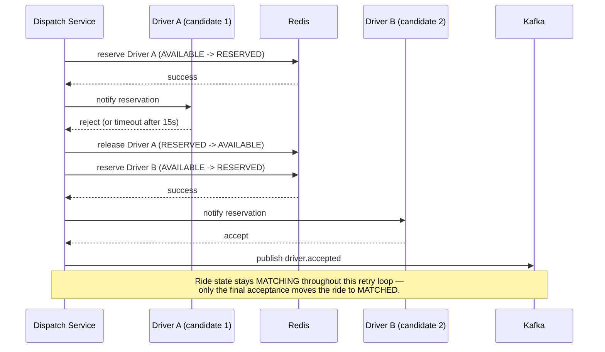
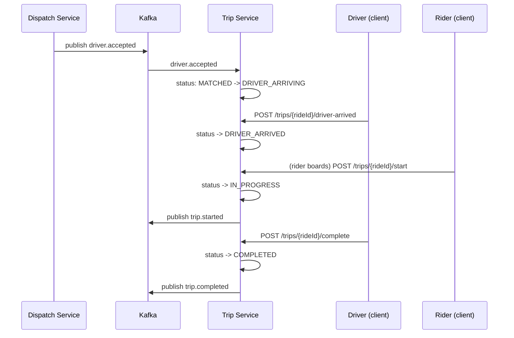
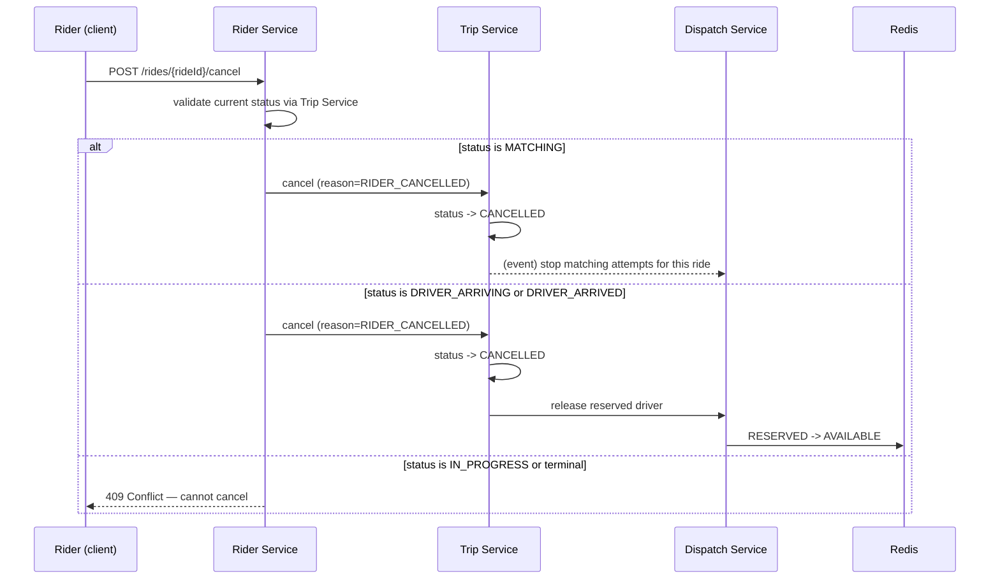

# Sequence Diagrams

These trace the flows referenced in [overview.md](overview.md) and
[state-machines.md](state-machines.md) end to end, including the non-happy paths.

## 1. Ride request → dispatch → reservation (happy path)

## 2. Driver rejects → dispatch retries next candidate

## 3. Driver accepts → trip lifecycle to completion

## 4. Rider cancels mid-flow

