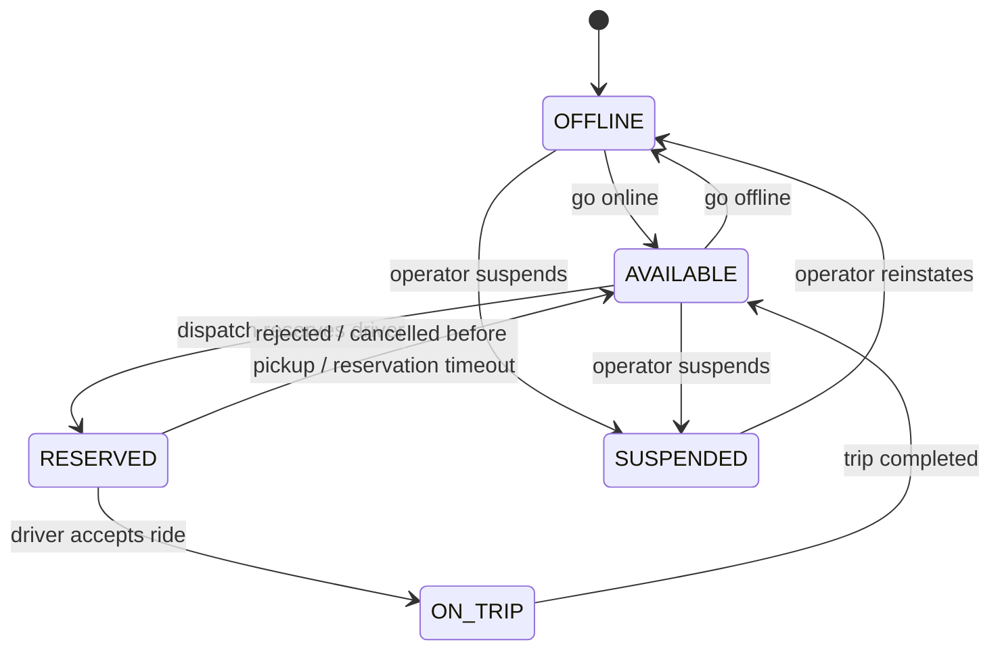
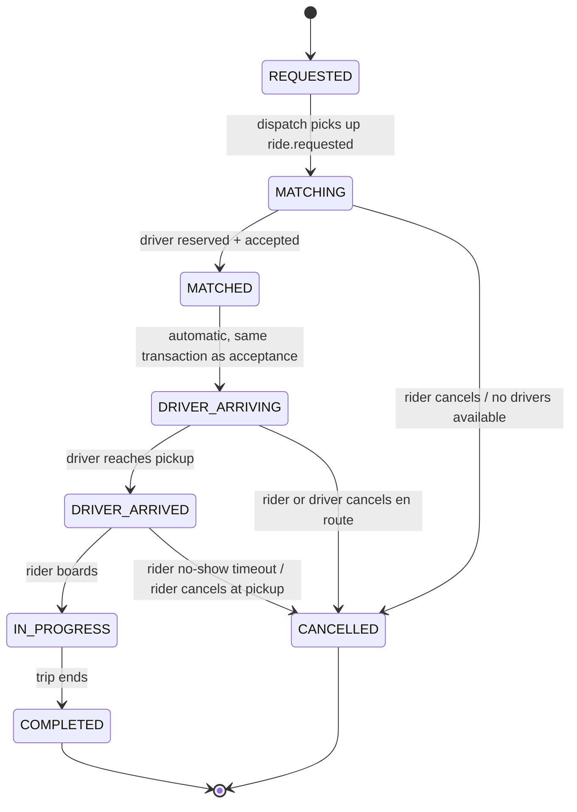

# State Machines

Both machines below are exhaustive: any transition not listed is invalid and must be
rejected (4xx at the API layer in Phase 2, guarded again at the DB layer in Phase 3).

## Driver state machine

States: `OFFLINE`, `AVAILABLE`, `RESERVED`, `ON_TRIP`, `SUSPENDED`.

| From | To | Trigger | Notes |
|---|---|---|---|
| `OFFLINE` | `AVAILABLE` | Driver goes online | Requires a valid, non-stale location already on file |
| `AVAILABLE` | `OFFLINE` | Driver goes offline | Disallowed while `RESERVED` or `ON_TRIP` — must resolve the active ride first |
| `AVAILABLE` | `RESERVED` | Dispatch atomically reserves the driver | The atomic operation itself (Phase 7) is what prevents double assignment |
| `RESERVED` | `AVAILABLE` | Driver rejects, rider cancels before acceptance, or reservation times out | Reservation timeout is a fixed window (see below), not indefinite |
| `RESERVED` | `ON_TRIP` | Driver accepts the ride | Driver is considered committed from acceptance, not just from trip start |
| `ON_TRIP` | `AVAILABLE` | Trip reaches `COMPLETED` | A driver cannot self-transition out of `ON_TRIP` any other way in the MVP |
| `OFFLINE` / `AVAILABLE` | `SUSPENDED` | Operator action | Not reachable from `RESERVED`/`ON_TRIP` — an active ride must be resolved first |
| `SUSPENDED` | `OFFLINE` | Operator reinstatement | Driver must explicitly go online again afterward |

Explicitly invalid (non-exhaustive, called out because they're easy to get wrong):
`OFFLINE → RESERVED`, `OFFLINE → ON_TRIP`, `AVAILABLE → ON_TRIP` (must pass through
`RESERVED`), `ON_TRIP → OFFLINE`, `ON_TRIP → SUSPENDED`.

**Reservation timeout**: a driver has a fixed window (default 15s, configurable) to
accept or reject once `RESERVED`. No response within the window is treated identically
to a rejection.

## Ride / trip state machine

States: `REQUESTED`, `MATCHING`, `MATCHED`, `DRIVER_ARRIVING`, `DRIVER_ARRIVED`,
`IN_PROGRESS`, `COMPLETED`, `CANCELLED`.

| From | To | Trigger | Notes |
|---|---|---|---|
| `REQUESTED` | `MATCHING` | Dispatch consumes `ride.requested` | |
| `MATCHING` | `MATCHED` | A driver is reserved **and** accepts | Rejections during this window do not change ride state — Dispatch just tries the next candidate internally |
| `MATCHING` | `CANCELLED` | Rider cancels, or all candidates (including one radius expansion) are exhausted | Cancellation reason recorded — see below |
| `MATCHED` | `DRIVER_ARRIVING` | Immediate, part of the same transaction as driver acceptance | Not a separately triggerable transition |
| `DRIVER_ARRIVING` | `DRIVER_ARRIVED` | Driver marks arrival | |
| `DRIVER_ARRIVING` | `CANCELLED` | Rider or driver cancels before pickup | |
| `DRIVER_ARRIVED` | `IN_PROGRESS` | Rider boards / driver starts trip | Gated on the rider's 4-digit pickup OTP — see below |
| `DRIVER_ARRIVED` | `CANCELLED` | Rider no-show past timeout, or rider cancels at the curb | |
| `IN_PROGRESS` | `COMPLETED` | Trip ends normally | |

**`IN_PROGRESS → CANCELLED` is explicitly not a supported transition in the MVP.** A
trip that must be aborted mid-route is an operational/incident scenario handled outside
the normal state machine (out of scope — see [prd.md](prd.md)).

**Cancellation reasons** (stored as metadata on the `CANCELLED` state, not as separate
states — keeps the enum small while preserving the "why"):
`RIDER_CANCELLED`, `DRIVER_CANCELLED`, `NO_DRIVERS_AVAILABLE`, `RIDER_NO_SHOW`,
`SYSTEM_CANCELLED`.

**Pickup OTP**: `MATCHED -> DRIVER_ARRIVING` (the driver's accept) mints a 4-digit code
on the ride, readable only by the rider (`GET /trips/{id}/otp`, see
[api-contracts.md](api-contracts.md)). `DRIVER_ARRIVED -> IN_PROGRESS` (`start()`)
requires that code in the request body and rejects a mismatch with `400`, leaving the
ride at `DRIVER_ARRIVED` for the driver to retry rather than treating a mistyped code as
a state-machine violation. This is deliberately a one-step,
driver-enters-what-the-rider-reads-out check, not a full identity-verification flow.

## Why driver rejection doesn't change ride state

A ride only moves to `MATCHED` once a specific driver has accepted. Rejections (or
timeouts) during the `MATCHING` window are Dispatch Service's internal retry loop
against Redis GEO candidates — from the ride's perspective nothing observable has
changed yet, so there is no ride-state transition to make. This keeps the ride state
machine small and keeps retry logic entirely inside Dispatch, where it belongs
(Phase 7).
